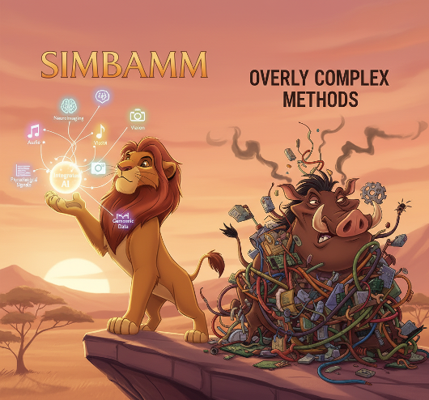

# Fusion or Confusion?

[](https://arxiv.org/pdf/2512.22991)

## Abstract

<div align="justify">
Deep learning architectures for multimodal learning have increased in complexity, driven by the assumption that multimodal-specific methods improve performance. We challenge this assumption through a large-scale empirical study reimplementing 19 high-impact methods under standardized conditions. We evaluate them across nine diverse datasets with up to 23 modalities, and test their generalizability to new tasks beyond their original scope, including settings with missing modalities. We propose a Simple Baseline for Multimodal Learning (SimBaMM), a late-fusion Transformer architecture, and demonstrate that under standardized experimental conditions with rigorous hyperparameter tuning of all methods, more complex architectures do not reliably outperform SimBaMM. Statistical analyses show that complex methods perform on par with SimBaMM and often fail to consistently outperform well-tuned unimodal baselines, especially in small-data settings. To support our findings, we include a case study highlighting common methodological shortcomings in the literature followed by a pragmatic reliability checklist to promote comparable, robust, and trustworthy future evaluations. In summary, we argue for a shift in focus: away from the pursuit of architectural novelty and toward methodological rigor.
</div>

## Get Started
#### Overview:
- All essential Python modules are located in the `codefiles` directory.
- Method re-implementations can be found primarily in `codefiles/methods` (with some located in other subfolders such as `codefiles/encoders` if necessary).
- Use `main.ipynb` for quick experimentation and debugging; use `main.py` for full-scale training and evaluation runs.

#### Running a Method on MOSI
To get started quickly, you can download the MOSI dataset (which originates from the [IMDer repository](https://github.com/mdswyz/IMDer?tab=readme-ov-file)) as described in the following. This dataset is compatible with our MOSI dataloader.
First, install the required `gdown` package:
```bash
pip install gdown
```
Then, download the dataset with:
```python
import gdown
url = 'https://drive.google.com/uc?id=1VqjkYqcgUlggZVN7B3NpXwQ-BIWIXxkj'
output = 'file.pkl'
gdown.download(url, output, quiet=False)
```
Place `file.pkl` in the appropriate data directory for your experiments and change the path in the MOSI dataset class accordingly (`codefiles/datasets/mosi_mosei.py`). Next, configure your experiment settings in `config/config.yaml` by setting the `dataset`, `encoders`, and `modelname` fields as desired. 

Note: Weights & Biases (WandB) logging is enabled by default and can be managed via the `wandb` section in the config file. If you prefer to disable WandB, you can comment out the related lines in `main.py` or `main.ipynb`.

## Add further datasets, methods, ...
TODO 